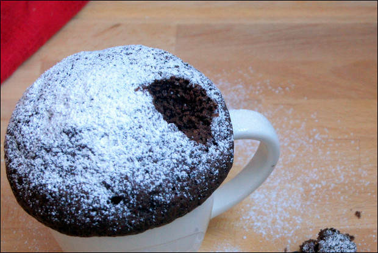

# Кекс в кружке

Калорийность | Белки | Жиры | Углеводы
--- | --- | --- | ---
**978** | **22** | **44** | **124**

## Ингридиенты

1. Сахар
2. Яйцо
3. Пшеничная мука
4. Растительное масло
5. Разрыхлитель
6. Молоко
7. Соль
8. Какао 