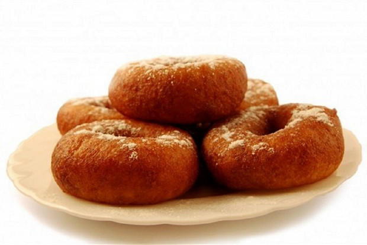

# Пончик

Калорийность | Белки | Жиры | Углеводы
--- | --- | --- | ---
**533** | **8** | **33** | **52**

## Ингридиенты

1. Сахар
2. Яйцо
3. Пшеничная мука
4. Растительное масло
5. Разрыхлитель
6. Молоко
7. Соль
8. Какао 

## Способ приготовления
---

- Смешать заранее подготовленные и отмеренные ингредиенты до однородной консистенции.
- Наполнить кружку тестом (примерно наполовину).
- Поставить кружку с тестом в микроволновку на 3–3,5 минуты. На этом интересном этапе кекс поднимется в 2 раза!

**Цитаты**
===
> *Брак — это **кекс** на завтрак, на обед и на ужин: тем, что обожаешь, тоже можно обожраться до тошноты.*

> *Большая империя, как и большой **кекс**, начинает крошиться с краёв.*

> *Честный ребенок любит не маму с папой, а **кекс**.*